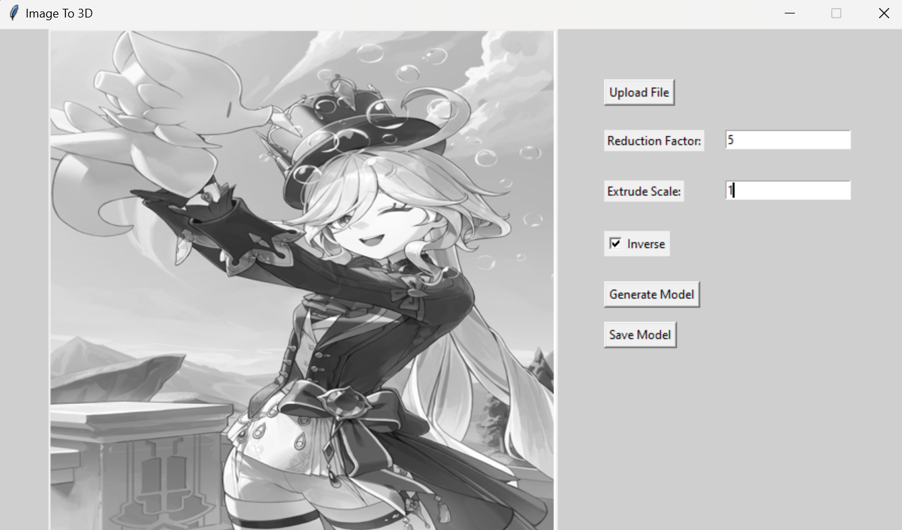
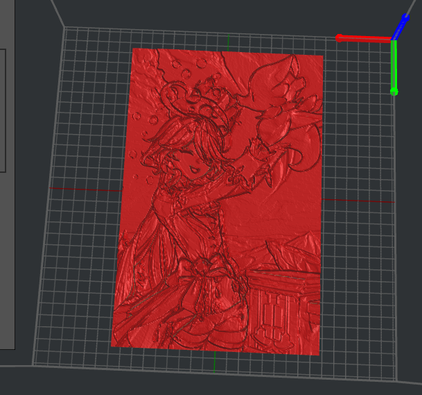

!# Image to 3d

A python project that converts images to 3d models for 3d printing

## Features
- **Image to 3d model**: Convert images to 3d models


## Usage
```bash
python imageTo3D_UI.py
```

## Images

### UI


### Model


